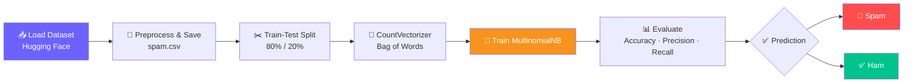

<div align="center">


<br/>


</div>

---

## 📑 Table of Contents

- [🎯 Objective](#-objective)
- [🛠️ Tech Stack](#️-tech-stack--libraries)
- [🔄 How It Works](#-how-it-works)
- [🧠 Key Concepts](#-key-concepts-implemented)
- [📊 Model Performance](#-model-performance)
- [📂 Project Structure](#-project-structure)
- [🚀 Getting Started](#-getting-started)
- [🤝 Connect](#-connect-with-me)

---

## 🎯 Objective

This project is an end-to-end **Natural Language Processing (NLP)** pipeline that classifies SMS messages as either:

| Label | Meaning |
|:---:|:---|
| 🚫 **Spam** | Fraudulent / promotional messages |
| ✅ **Ham** | Normal, legitimate messages |

---

## 🛠️ Tech Stack & Libraries

<div align="center">

| Purpose | Tool |
|:---|:---|
| 🐍 Language | `Python` |
| 🐼 Data Manipulation | `pandas` |
| 🤖 Machine Learning | `scikit-learn` (CountVectorizer, MultinomialNB) |
| 📦 Data Sourcing | `datasets` (Hugging Face) |

</div>

---

## 🔄 How It Works



---

## 🧠 Key Concepts Implemented

1. **📥 Data Ingestion** — Fetched modern SMS spam data from Hugging Face and processed it into a `.csv` file.
2. **✂️ Train-Test Split** — Divided the dataset (80% training, 20% testing) for unbiased evaluation.
3. **🔢 Text Vectorization** — Used `CountVectorizer` to convert text messages into numerical token counts (Bag of Words).
4. **🤖 Model Training** — Trained a `MultinomialNB` (Naive Bayes) classifier, efficient for text classification based on word probabilities.
5. **📊 Evaluation Metrics** — Analyzed the model using Accuracy, Precision, and Recall.

---

## 📊 Model Performance

<div align="center">


| Metric | Score | Notes |
|:---|:---:|:---|
| ✅ Accuracy | **98.57%** | Overall correctness of the model |
| 🎯 Precision (Spam) | **97%** | Prioritized to prevent normal messages landing in spam |
| 📥 Recall (Spam) | **93%** | Ability to catch actual spam messages |

</div>

---

## 📂 Project Structure

```text
├── spam.csv        # Dataset downloaded and parsed from Hugging Face
├── pipeline.py      # Main Python script for vectorization, training, and testing
└── README.md        # Project documentation
```

---

## 🚀 Getting Started

```bash
# 1️⃣ Clone the repository
git clone https://github.com/your-username/sms-spam-detector.git
cd sms-spam-detector

# 2️⃣ Install dependencies
pip install pandas scikit-learn datasets

# 3️⃣ Run the pipeline
python pipeline.py
```

---

## 🤝 Connect with Me

<div align="center">

[](https://github.com/your-username)
[](https://linkedin.com/in/your-profile)
[](https://fiverr.com/your-profile)
[](https://upwork.com/freelancers/your-profile)

</div>


